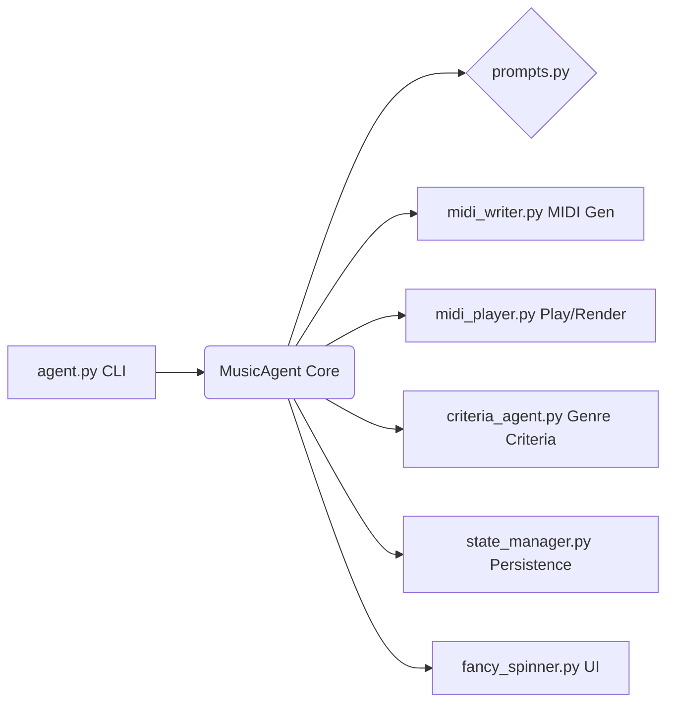

# Autonomous Music Agent 🎹✨

[](https://opensource.org/licenses/MIT)
[](https://www.python.org/downloads/)


A terminal-based autonomous agent that composes, plays, analyzes, and iteratively improves short MIDI loops using the OpenAI API, `pretty_midi`, and FluidSynth. This agent specializes in leveraging the unique sound palette of the **Undertale SoundFont**.

## Features

-   **Autonomous Composition:** Generates original MIDI loops based on user-specified styles (e.g., "synthwave", "jazz").
-   **Iterative Refinement:** Mutates existing loops based on AI-driven analysis and feedback, improving musicality over time.
-   **Undertale SoundFont Integration:** Utilizes instruments from the Undertale SoundFont for a distinct sound.
-   **Local Playback & Rendering:** Plays MIDI files directly and renders them to WAV using FluidSynth.
-   **Agentic Workflow:** Streams agent thoughts, decisions, and actions to the terminal for transparency.
-   **State Management:** Saves run history (MIDI, WAV, analysis) for traceability and potential warm restarts.

## Architecture

The system employs an agent-based architecture with distinct components responsible for specific tasks:



-   **`agent.py`**: CLI entry point; loads environment variables, gets user input (style), and initiates the main agent loop.
-   **`music_agent.py`**: The core agent logic. Manages interaction with the OpenAI API (GPT-4.1), orchestrates the composition/mutation loop, handles state, and utilizes other components.
-   **`midi_writer.py`**: Contains tools (`pretty_midi` based) for generating new MIDI loops and applying mutations to existing ones based on agent instructions.
-   **`midi_player.py`**: Handles MIDI playback and rendering to WAV audio files using `pyfluidsynth`.
-   **`prompts.py`**: Centralized repository for all system prompts, tool descriptions, and few-shot examples used to guide the LLM, including detailed `pretty_midi` usage documentation.
-   **`criteria_agent.py`**: Uses an LLM call to generate genre-specific musical evaluation criteria.
-   **`state_manager.py`**: Simple JSON-based persistence for saving agent memory and run history.
-   **`fancy_spinner.py`**: Provides a visual spinner in the terminal during long operations (LLM calls, code execution).

## Workflow

1.  **Initialization:** The user provides a musical style.
2.  **Composition:** The `MusicAgent` requests Python code from the LLM (using `compose_prompt_template`) to generate an initial MIDI loop in the desired style.
3.  **Execution:** The generated code is executed, creating the first MIDI file (`loop_1.mid`).
4.  **Playback & Rendering:** The MIDI is rendered to WAV (`loop_1.wav`) and played back.
5.  **Analysis (Implicit/Realtime):** The agent analyzes the result (potentially using external feedback loops or internal criteria).
6.  **Mutation:** The `MusicAgent` requests new Python code from the LLM (using `mutate_prompt_template`), providing the previous code, analysis feedback, and the goal (e.g., add a new instrument layer).
7.  **Execution:** The mutation code is executed, loading the previous MIDI and saving a new version (`loop_N.mid`).
8.  **Iteration:** Steps 4-7 repeat, iteratively refining the musical loop.

## Setup

1.  **Clone the repository:**
    ```bash
    git clone <repository_url>
    cd autonomous-music-agent
    ```

2.  **Create and activate a virtual environment:**
    ```bash
    python3 -m venv venv
    source venv/bin/activate
    # On Windows use `venv\Scripts\activate`
    ```

3.  **Install dependencies:**
    ```bash
    pip install -r requirements.txt
    ```
    *Note: `pyfluidsynth` might require `fluidsynth` to be installed on your system (`brew install fluidsynth` on macOS, `apt-get install fluidsynth` on Debian/Ubuntu).*

4.  **Set environment variables:** Create a `.env` file in the project root or export variables directly:
    ```bash
    # .env file content
    OPENAI_API_KEY="sk-..."
    SOUND_FONT_PATH="/path/to/your/soundfont.sf2"
    ```
    *   **`OPENAI_API_KEY`**: Your OpenAI API key.
    *   **`SOUND_FONT_PATH`**: Path to a SoundFont file (`.sf2`).
        *   Download the sound path file I used here weedsgm3.sf2 - - - - [https://www.philscomputerlab.com/general-midi-and-soundfonts.html]).

5.  **Run the agent:**
    ```bash
    python agent.py
    ```
    You will be prompted to enter a music style.

## Requirements

-   Python 3.8+
-   OpenAI API Key
-   FluidSynth library installed system-wide
-   SoundFont file (`.sf2`)

## Development Notes

-   **Error Handling:** The agent includes retry logic for LLM code generation errors.
-   **Code Execution:** Uses `exec()` to run AI-generated Python code within a controlled environment. Review generated code before execution if modifying the agent.
-   **State:** Run data is stored in the `runs/` directory, organized by timestamp.
-   **Prompts:** The core agent behavior is heavily influenced by the prompts in `prompts.py`.

## License

This project is licensed under the MIT License. 